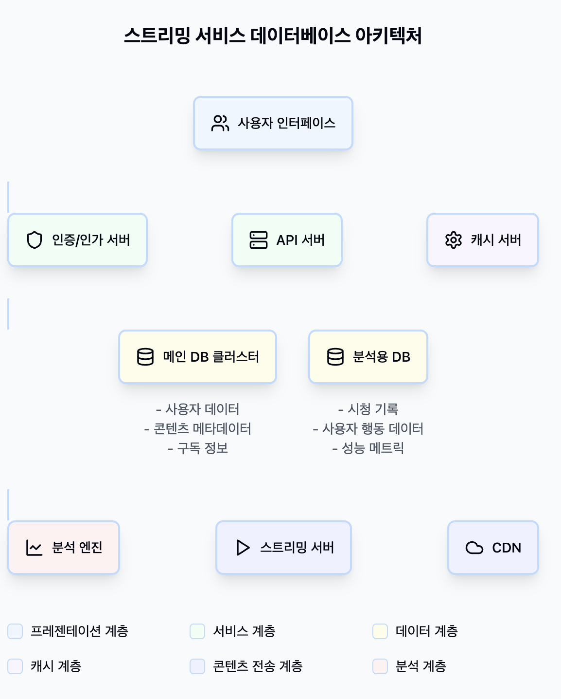
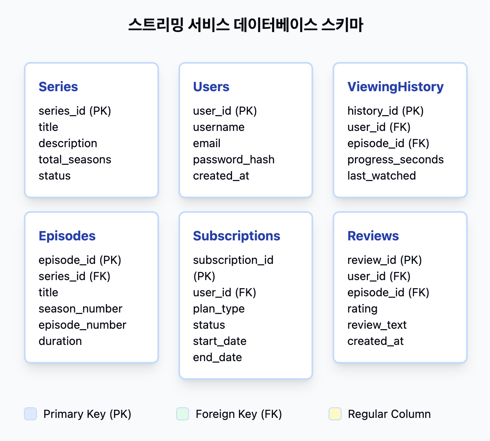
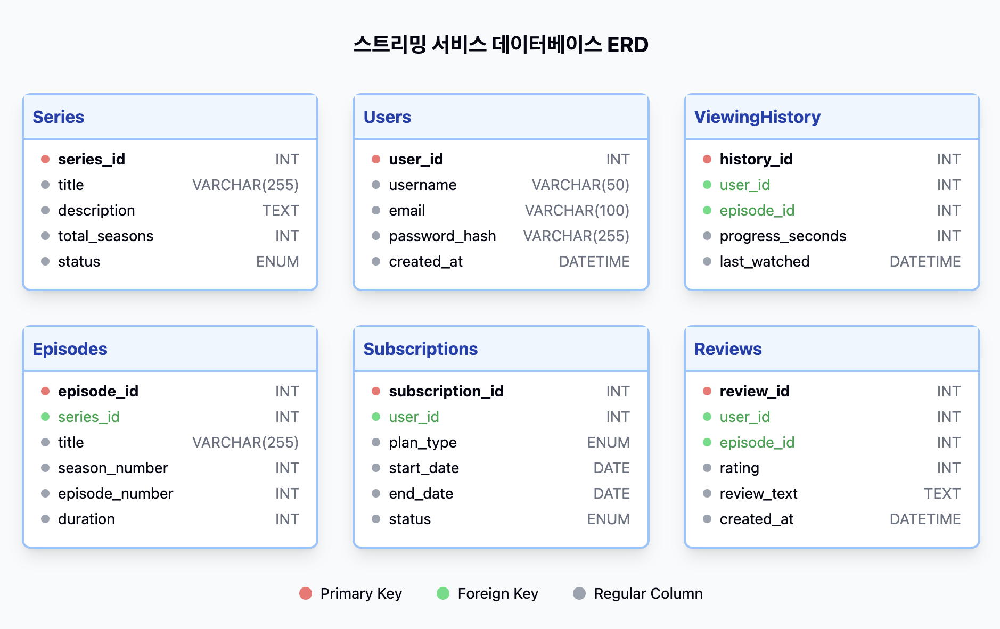

# 스트리밍 서비스 데이터베이스 설계 프로젝트 (쿠팡 플레이)

## 프로젝트 개요

이 프로젝트의 목표는 쿠팡 플레이와 같은 대규모 스트리밍 서비스의 데이터베이스를 설계하고 구현하는 것을 목표로 합니다. 
사용자 경험 최적화와 효율적인 콘텐츠 관리를 위한 확장 가능한 데이터베이스 구조를 제공하고자 합니다.

### 프로젝트 목표
- 대규모 동시 접속 처리를 위한 효율적인 데이터베이스 구조 설계
- 실시간 시청 기록 및 사용자 활동 처리 지원
- 데이터 정합성 및 일관성 보장
- 향후 확장성을 고려한 유연한 스키마 설계

## 데이터베이스 설계 원칙

### 1. 정규화 전략
- **1NF**: 원자성 보장
- **2NF**: 부분 종속성 제거
- **3NF**: 이행 종속성 제거
- 필요한 경우 선택적 반정규화 적용

### 2. 데이터 무결성
- **개체 무결성**: Primary Key 제약조건
- **참조 무결성**: Foreign Key 제약조건
- **도메인 무결성**: Check 제약조건

## 데이터베이스 아키텍처


## 주요 기능

### 핵심 기능
- 사용자 계정 및 프로필 관리
- 콘텐츠 **메타데이터 관리** (시리즈 및 에피소드 포함)
- 시청 기록 추적 및 분석
- 구독 및 결제 관리
- 리뷰 및 평점 시스템

## 핵심 데이터 모델

### 1. 콘텐츠 관리
```sql
-- 시리즈 테이블
CREATE TABLE series (
    series_id INT PRIMARY KEY AUTO_INCREMENT,
    title VARCHAR(255) NOT NULL,
    description TEXT,
    total_seasons INT,
    status ENUM('ongoing', 'completed', 'upcoming') DEFAULT 'ongoing',
    created_at DATETIME DEFAULT CURRENT_TIMESTAMP,
    updated_at DATETIME DEFAULT CURRENT_TIMESTAMP ON UPDATE CURRENT_TIMESTAMP
);

-- 에피소드 테이블
CREATE TABLE episodes (
    episode_id INT PRIMARY KEY AUTO_INCREMENT,
    series_id INT,
    title VARCHAR(255) NOT NULL,
    season_number INT,
    episode_number INT,
    duration INT COMMENT '초 단위',
    release_date DATE,
    FOREIGN KEY (series_id) REFERENCES series(series_id),
    UNIQUE KEY unique_episode (series_id, season_number, episode_number)
);
```

### 2. 사용자 관리
```sql
-- 사용자 테이블
CREATE TABLE users (
    user_id INT PRIMARY KEY AUTO_INCREMENT,
    email VARCHAR(255) UNIQUE NOT NULL,
    password_hash VARCHAR(255) NOT NULL,
    name VARCHAR(100),
    status ENUM('active', 'suspended', 'deleted') DEFAULT 'active',
    created_at DATETIME DEFAULT CURRENT_TIMESTAMP,
    last_login DATETIME
);

-- 사용자 프로필 설정 테이블
CREATE TABLE user_preferences (
    user_id INT PRIMARY KEY,
    language VARCHAR(10) DEFAULT 'ko',
    subtitle_language VARCHAR(10),
    autoplay BOOLEAN DEFAULT TRUE,
    FOREIGN KEY (user_id) REFERENCES users(user_id)
);
```

### 고급 기능
- 시리즈 및 에피소드 관계 관리
- 다중 장르 지원
- 콘텐츠 라이선스 및 지역 제한 관리
- 사용자 활동 감사(Audit) 추적
- 성능 모니터링 및 분석

## 성능 최적화 전략

### 1. 인덱스 설계
```sql
-- 시청 기록 조회 최적화
CREATE INDEX idx_viewing_history_user 
    ON viewing_history(user_id, watched_at);

-- 콘텐츠 검색 최적화
CREATE INDEX idx_content_title 
    ON content(title, release_date);

-- 구독 상태 확인 최적화
CREATE INDEX idx_subscription_status 
    ON subscriptions(user_id, status, end_date);
```

### 2. 파티셔닝 전략
```sql
-- 시청 기록 아카이빙용 파티셔닝
CREATE TABLE viewing_history_archive (
    history_id INT,
    user_id INT,
    content_id INT,
    watched_at DATETIME,
    duration INT,
    PRIMARY KEY (history_id, watched_at)
) PARTITION BY RANGE (UNIX_TIMESTAMP(watched_at)) (
    PARTITION p_2023_q1 VALUES LESS THAN (UNIX_TIMESTAMP('2023-04-01')),
    PARTITION p_2023_q2 VALUES LESS THAN (UNIX_TIMESTAMP('2023-07-01')),
    PARTITION p_max VALUES LESS THAN MAXVALUE
);
```

### 3. 데이터 아카이빙
```sql
-- 아카이빙 프로시저
DELIMITER //
CREATE PROCEDURE archive_old_views()
BEGIN
    INSERT INTO viewing_history_archive 
    SELECT * FROM viewing_history 
    WHERE watched_at < DATE_SUB(NOW(), INTERVAL 3 MONTH);
    
    DELETE FROM viewing_history 
    WHERE watched_at < DATE_SUB(NOW(), INTERVAL 3 MONTH);
END //
DELIMITER ;
```

## 모니터링 및 분석 뷰

```sql
-- 콘텐츠 인기도 분석
CREATE VIEW content_popularity AS
SELECT 
    c.content_id,
    c.title,
    COUNT(DISTINCT vh.user_id) as unique_viewers,
    AVG(vh.duration) as avg_watch_time,
    COUNT(r.review_id) as review_count,
    AVG(r.rating) as avg_rating
FROM content c
LEFT JOIN viewing_history vh ON c.content_id = vh.content_id
LEFT JOIN reviews r ON c.content_id = r.content_id
GROUP BY c.content_id, c.title;

-- 구독 분석 뷰
CREATE VIEW subscription_analysis AS
SELECT 
    DATE_FORMAT(created_at, '%Y-%m') as month,
    COUNT(*) as new_subscriptions,
    COUNT(CASE WHEN status = 'active' THEN 1 END) as active_subscriptions,
    COUNT(CASE WHEN status = 'cancelled' THEN 1 END) as cancellations
FROM subscriptions
GROUP BY DATE_FORMAT(created_at, '%Y-%m');
```

## 데이터베이스 구조

### 스트리밍 서비스 DB 스키마


### 스트리밍 서비스 DB ERD


### 주요 테이블
- **users**: 사용자 정보
- **content**: 콘텐츠 정보
- **series**: 시리즈 정보
- **genre**: 장르 정보
- **view_history**: 시청 기록
- **subscriptions**: 구독 정보
- **payments**: 결제 정보
- **reviews**: 리뷰 정보

### 보조 테이블
- **content_series**: 시리즈-에피소드 관계
- **content_genre**: 콘텐츠-장르 관계
- **audit_logs**: 변경 이력 추적

## 성능 최적화

### 인덱싱 전략
- 자주 조회되는 컬럼에 대한 인덱스 생성
- 조인 성능 향상을 위한 외래 키 인덱싱
- 복합 인덱스를 통한 쿼리 최적화

### 성능 개선 방안
- 시청 기록 테이블 파티셔닝
- 자주 사용되는 쿼리를 위한 materialized view
- 시계열 데이터 아카이빙 전략

## 보안 및 감사

### 1. 데이터 암호화
```sql
-- 민감 정보 암호화 함수
DELIMITER //
CREATE FUNCTION encrypt_sensitive_data(data TEXT) 
RETURNS VARBINARY(255)
BEGIN
    RETURN AES_ENCRYPT(data, @encryption_key);
END //
DELIMITER ;
```

### 2. 감사 로그
```sql
-- 데이터 변경 추적을 위한 감사 로그
CREATE TABLE audit_logs (
    audit_id INT PRIMARY KEY AUTO_INCREMENT,
    table_name VARCHAR(64),
    operation ENUM('INSERT', 'UPDATE', 'DELETE'),
    record_id INT,
    changed_by INT,
    changed_at DATETIME DEFAULT CURRENT_TIMESTAMP,
    old_value JSON,
    new_value JSON,
    FOREIGN KEY (changed_by) REFERENCES users(user_id)
);
```

## 확장 고려사항

### 1. 샤딩 전략
- 사용자 ID 기반 샤딩
- 콘텐츠 ID 기반 샤딩
- 시간 기반 샤딩

### 2. 캐싱 전략
- 자주 접근하는 메타데이터 캐싱
- 사용자 세션 정보 캐싱
- 인기 콘텐츠 목록 캐싱

## 설치 및 설정

1. 저장소 클론
```bash
git clone https://github.com/your-username/coupang-play-db-project.git
```

2. MySQL 8.0 설치 (필요한 경우)
```bash
# Ubuntu
sudo apt-get install mysql-server

# macOS
brew install mysql@8.0
```

3. 데이터베이스 생성
```bash
mysql -u root -p < sql/create_database.sql
```

4. 초기 데이터 로드 (선택사항)
```bash
mysql -u root -p coup

ang_play < sql/sample_data.sql
```

## 모니터링 및 분석

### 주요 지표
- 동시 접속자 수
- 콘텐츠별 시청 시간
- 구독 갱신율
- 사용자당 평균 시청 시간

### 분석용 뷰
- **content_popularity**: 콘텐츠 인기도 분석
- **user_engagement**: 사용자 참여도 분석
- **subscription_metrics**: 구독 지표 분석

## 향후 계획

### 1. 보안 기능
- 사용자 정보 암호화
- 결제 정보 분리 저장
- 접근 권한 관리
- 변경 이력 추적 시스템

### 2. 단기 목표
- 시리즈/에피소드 관리 시스템 고도화
- 메타데이터 관리 기능 확장
- 성능 모니터링 시스템 구축

### 3. 장기 목표
- NoSQL 데이터베이스 통합
- 머신러닝 기반 추천 시스템 도입
- 실시간 데이터 처리 시스템 구축
